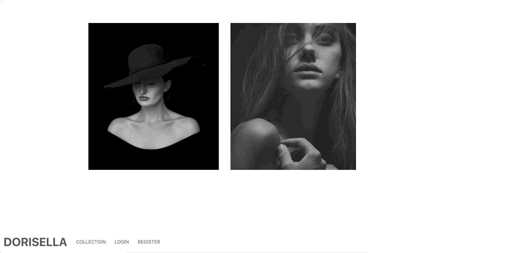
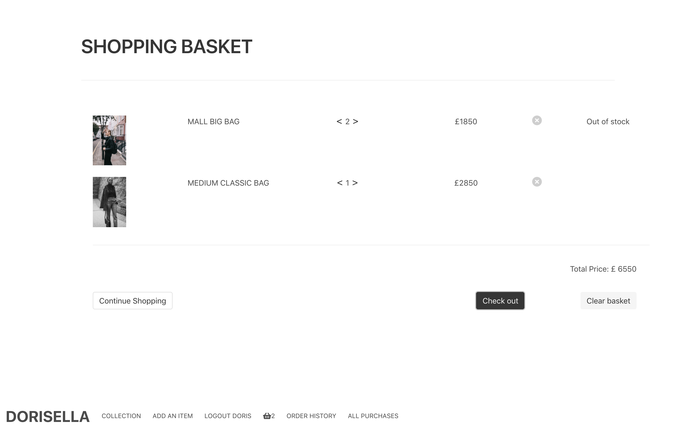
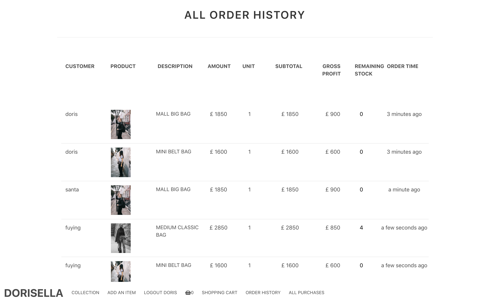
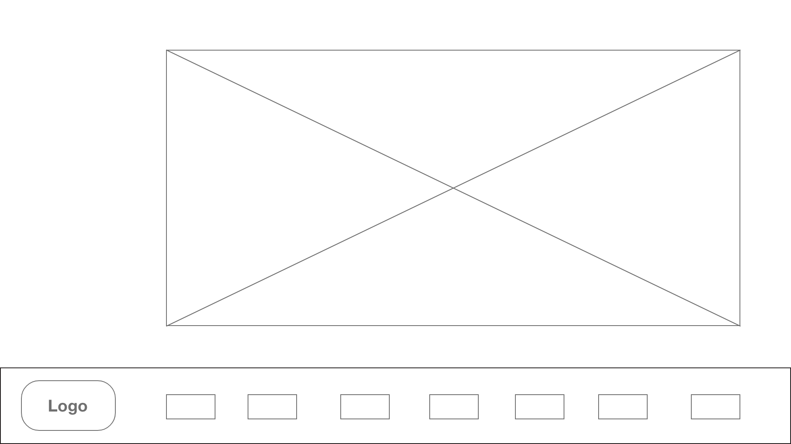
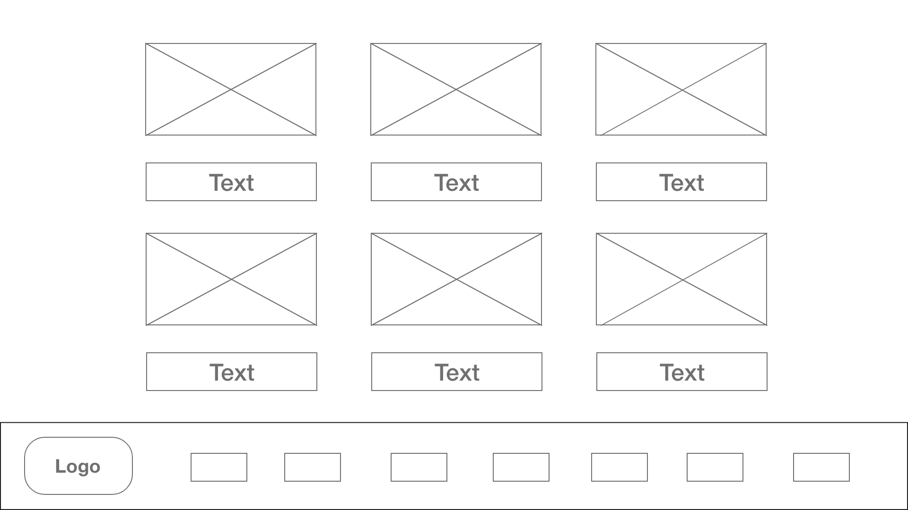
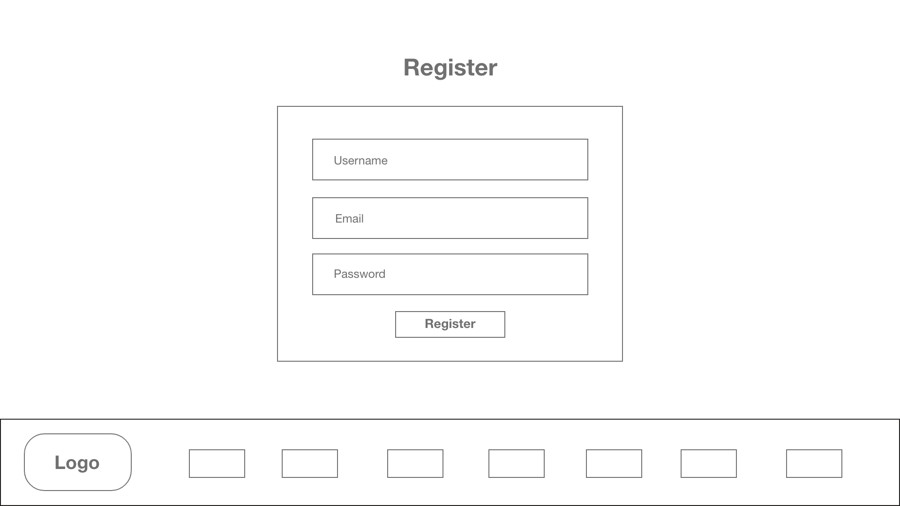
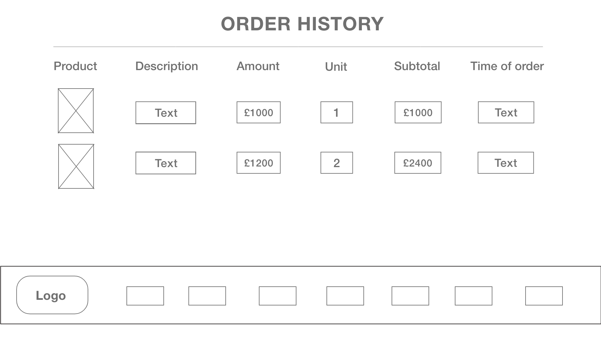

# General Assembly WDI Project 4: Dorisella

[Heroku Pages](https://dorisella.herokuapp.com/)

[GitHub Repo](https://github.com/huangfuin1101/wdi-project-four-dorisella)

Dorisella is an online shopping website, especially for women's handbags. It allows the user to purchase the item when register and login. The user can add items in the basket, also can check order history when the purchase is successful. Once login as admin identity, items can be added, updated and deleted. All the purchases made can be traced to adjust the stock condition.

## Home Page


## Collection (Bag Index)


## Register


## Login


## Buy a Bag (Bag Show)


## Basket


## Order History


## Add an Item


## Edit an Item


## All Purchase History


---

## Project Brief

* Build a full-stack application by making your own backend and your own front-end
* Use an Express API to serve your data from a Mongo database
* Consume your API with a separate front-end built with React
* Be a complete product which most likely means multiple relationships and CRUD functionality for at least a couple of models
* Implement thoughtful user stories/wireframes that are significant enough to help you know which features are core MVP and which you can cut
* Have a visually impressive design to kick your portfolio up a notch and have something to wow future clients & employers. ALLOW time for this.
* Be deployed online so it's publicly accessible.
* Have automated tests for at least one RESTful resource on the back-end, and at least one classical and one functional component on the front-end. Improve your employability by demonstrating a good understanding of testing principals.

## Technologies Used

* Git
* GitHub
* Heroku
* JavaScript (ECMAScript 6)
* Node.js
* express: v4.16.3
* MongoDB
* mongoose: v5.1.1
* body-parser: v1.18.3
* method-override: v3.5.0
* bcrypt: v2.0.1
* atob: v2.1.1
* jsonwebtoken: v8.2.1
* axios: v0.18.0
* react: v16.3.2
* react-dom: v16.3.2
* react-router-dom: v4.2.2
* babel-plugin-transform-class-properties: v6.24.1
* babel-plugin-transform-object-rest-spread: v6.26.0
* moment: v2.22.2
* chai: v4.1.2
* mocha: v5.2.0
* enzyme: v3.3.0
* enzyme-adapter-react-16: v1.1.1
* sinon: v5.0.7
* CSS3 with animation
* Bulma: v0.7.1
* Sass
* Google Fonts
* Favicon
* Fontawesome
* Adobe XD CC
* Trello

## Approach Taken

### Wireframes
The wireframes are made by Adobe XD.

#### Home


#### Collection (Bag Index)


#### Register


#### Login


#### Buy a bag (Bag Show)


#### Basket


#### Order history



## Functionality
I used Trello to organise this project.


I began with the backend, aiming to have a strong and stable back end before rendering front end pages. Most of the back end was managed to work and tested in a few days, except for the part that checks stock and tells which item is not enough stock, which was a bit challenged at the beginning.

For the front end, I worked on rendering most of the pages at first. and then added the stock check part later on. I finished most of the front end at the beginning and then left some time for styling.

### Featured Piece of Code no.1

This is where to check if the purchased item is enough compared with the stock. If it's enough, the current stock will be taken out the unitQuantity been purchased. I used pre validate to check if the stock is enough for purchase, if so, the purchase will be created and takes out from the current stock. If insufficient stock, by using error handler, catching the error to showing the id of the item which is not enough stock.
 [./models/purchase.js](https://github.com/huangfuin1101/wdi-project-four-dorisella/blob/master/models/purchase.js).

```JavaScript
purchaseSchema.pre('validate', function(next){
  this.populate('bag', () => {
    const enoughStock = this.bag.stock >= this.unitQuantity;
    if(!enoughStock){
      this.invalidate(this.bag._id.toString(), 'not enough stock');
    }
    next();
  });
});

purchaseSchema.pre('save', function(next){
  this.populate('bag', () => {
    this.bag.stock -= this.unitQuantity;
    this.bag.save(() => next());
  });
});

```
### Featured Piece of Code no.2
When press the checkout button, if all the items been purchased have enough stock, then purchase will be successful; if one of the items is insufficient, then catch the error, outOfStock showing the id of the item  which doesn't have enough stock.
From [./src/lib/basket.js](https://github.com/huangfuin1101/wdi-project-four-dorisella/blob/master/src/lib/basket.js).

```JavaScript
export function checkout() {
  axios.post('/api/checkout', getBasket(), {headers: {
    Authorization: `Bearer ${getToken()}`}})
    .then(() => {
      createBasket();
      createFlashMessage('Thank you for purchase');
      this.props.history.push('/purchases');
    })
    .catch((error) => {
    );
      this.setState({ outOfStock: error.response.data.outOfStock });
    });
}
```
Here, showing Out of stock to the item which is insufficient when press the checkout button.
From [./src/components/basket/Basket.js](https://github.com/huangfuin1101/wdi-project-four-dorisella/blob/master/src/components/basket/Basket.js).
```JavaScript
{this.state.outOfStock.includes(item._id) && <p>Out of stock</p>}
```
### Styling
I tried to keep the styling minimal. Basically, the colour scheme is black and white, shows classic at the same time presents a fashionable atmosphere.

### Wins and Blockers
Comparing the stock amount and the purchase quantity to see if the item is enough/not enough stock on the backend and showing the "out of stock" item on the front end was a huge wine also a block. It was tricky to compare the purchase quantity and the stock. After that, check which item is not enough in stock when making multiple purchases was another challenge.

Styling was another win. I'm happy with how it looks by using Bulma to display the page plus black and white design. The fixed-bottom navbar is another made the finishing point.

Write front end testing was another challenge as I have only practiced little and it was quite different from backend text.


### Future Features
There are some features I would like to add in the future:

* Improve responsive design.
* Create a message board for user to chat or query.
* User can swipe to see more images in the Show page.
* Update the basket synchronously when the retailPrice of the bag been changed or the bag been deleted.
